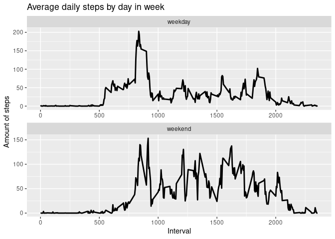

## Loading and preprocessing the data

First unzip the file and load it in


```r
library(dplyr)
```

```
## 
## Attaching package: 'dplyr'
```

```
## The following objects are masked from 'package:stats':
## 
##     filter, lag
```

```
## The following objects are masked from 'package:base':
## 
##     intersect, setdiff, setequal, union
```

```r
unzip("activity.zip")

activity <- data.table::fread("activity.csv")
```

## What is mean total number of steps taken per day?

Calculate the total number of steps taken per day


```r
daily <- summarise(group_by(activity, date), steps = sum(steps))
```

Histogram of the total number of steps per day


```r
library(ggplot2)

h <- ggplot(daily, aes(x = date, y = steps, fill = date, label = steps))
h + geom_histogram(stat = "identity")
```

<!-- -->

The mean and median of the total number of steps taken per day


```r
mn <- mean(daily$steps, na.rm = TRUE)
mdn <- median(daily$steps, na.rm = TRUE)
```

## What is the average daily activity pattern?

Time series plot of the 5-minute interval (x-axis) and the average number of steps taken, averaged across all days (y-axis)


```r
timeitv <- activity %>% group_by(interval) %>% summarise(avgstps = mean(steps, na.rm = TRUE))

timeplot <- ggplot(timeitv, aes(x = interval, y = avgstps))
timeplot + geom_line(col = "red", lwd = 1.5)
```

<!-- -->

## Imputing missing values
Calculate and report the total number of missing values in the dataset


```r
activity[is.na(steps), .N]
```

```
## [1] 2304
```

Fill in all the missing value in the dataset


```r
activity[is.na(steps), "steps"] <- activity[, c(lapply(.SD, median, na.rm = TRUE)), .SDcols = c("steps")]
```

Create a file with missing values filled in


```r
data.table::fwrite(x = activity, file = "./tidyData.csv", quote = FALSE)
```

Histogram , mean and median of new dataset


```r
ndaily <- summarise(group_by(activity, date), steps = sum(steps))

nh <- ggplot(ndaily, aes(x = date, y = steps, fill = date))
nh + geom_histogram(stat = "identity", binwidth = 100)
```

```
## Warning: Ignoring unknown parameters: binwidth, bins, pad
```

<!-- -->

```r
mnm = mean(ndaily$steps)
nmdn = median(ndaily$steps)
```
## Are there differences in activity patterns between weekdays and weekends?

Create a factor variable in the dataset with two levels – “weekday” and “weekend” indicating whether a given date is a weekday or weekend day.


```r
activity[, date := as.POSIXct(date, format = "%Y-%m-%d")]
activity[, "Days of week" := weekdays(date)]
activity[grepl("Monday|Tuesday|Wednesday|Thursday|Friday", x = `Days of week`), "weekday or weekend"] <- "weekday"
activity[grepl("Saturday|Sunday", x = `Days of week`), "weekday or weekend"] <- "weekend"
activity[, `weekday or weekend` := as.factor(`weekday or weekend`)]
```

Make a panel plot containing a time series plot (i.e. 𝚝𝚢𝚙𝚎 = “𝚕”) of the 5-minute interval (x-axis) and the average number of steps taken, averaged across all weekday days or weekend days (y-axis). See the README file in the GitHub repository to see an example of what this plot should look like using simulated data


```r
Interval <- activity[, lapply(.SD, mean, na.rm = TRUE), .SDcols = c("steps"), by = .(interval, `weekday or weekend`)]

ggplot(Interval, aes(x = interval, y = steps, fill = interval)) +
    geom_line(lwd = 1) + ggtitle("Average daily steps by day in week") +
    labs(x = "Interval", y = "Amount of steps") + facet_wrap(~`weekday or weekend`, nc = 1, scales = "free")
```

<!-- -->
